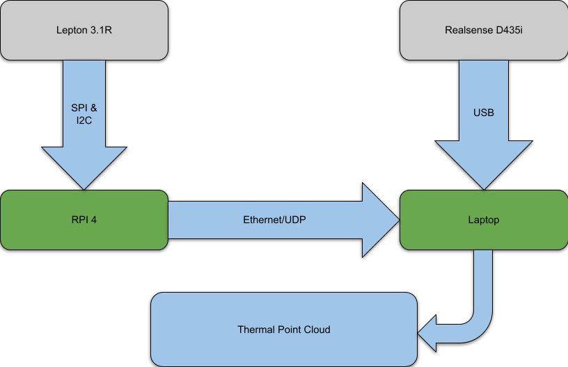

# Thermal Point Cloud

#### Author: Anuj Natraj

https://github.com/user-attachments/assets/0584e4b3-5929-4763-acd6-b2016e8b9847

## Package List

There are 3 main packages in this project each with their own builds. Apart from this you will need the Lepton 3.1R thermal camera and a RaspberryPi to stream the thermal data from the camera to your server. I have made a [package](https://github.com/AnujN9/LeptonModule/tree/master/software/raspberrypi_video_network) that sends the data from the RaspberryPi via a UDP socket. 

- stream - streams images and can save the images
    - streams raw data from the Lepton and converts it to an image
    - streams data from a RealSense D435i and the Lepton
- calibration - performs the camera calibration from images saved in its directory
    - calibration of intrinsics for the thermal camera. Saves to a calibration.xml file.
    - calibration of the extrinsics between the thermal camera and the RealSense. Saves to an extrinsic.xml file.
- pointcloud - generates a point cloud from the depth data and thermal data
    - creates a point cloud where the depth data determines the position and the thermal data determines the color of points based on a colormap. Also capable of saving the point cloud and loading it seperately.

## Project Flow

### Data

The data flow for this project is as follows:



I set up the RaspberryPi with a Lepton 3.1R. The thermal camera communicates between the RPi using I2C and sends the images via SPI. Once this data is acquired using a simple program to read the SPI communication, I send this raw data via UDP through an ethernet cable to my Laptop. A RealSense D435i is connnected via USB to the laptop. The data from the thermal camera and the RealSense is processed into a thermal pointcloud.

### Work Flow

To set up a point cloud of your own, follow these steps:
- First connect up an RPi with a Lepton camera using this [package](https://github.com/AnujN9/LeptonModule/tree/master/software/raspberrypi_video_network) to send raw data. You can find a [3D printable case](docs/thermal_case.step) that can house an RPi, Lepton camera and a Realsense as one unit.
- Once it is set up and streams data from the ethernet, use ```./lepton``` to stream the images and save images for calibration. Once you have saved atleast 10 images, move them to `calibration/thermal_images`.
- Based on the pattern, calibrate the thermal camera using ```./camera_calibration``` in `calibration` to find out the intrinsics. I have attached a [pattern](docs/chessboard_pattern.dxf) for a 3 by 4 chessboard pattern which can be laser cut.
- Save atleast 10 pairs of thermal and rgb images from `stream` using ```./depth_saver``` to calibrate the extrinsics. Use a chessboard pattern and move the thermal images to `calibration/thermal_images` and color images to `calibration/color_images`.
- Run ```./extrinsic``` to find the transform of the thermal camera in the rgb frame.
- `pointcloud` is used to generate point clouds. Move the 2 .xml files from `calibration` to `pointcloud`. Use ```./thermalPC``` to generate a stream of point clouds. You can save a point cloud by pressing 's'. Use ```./loadPC``` to load that saved point cloud.


## References

- https://henryzh47.github.io/assets/documents/multiple-methods-geometric.pdf
- https://github.com/groupgets/LeptonModule
- https://github.com/IntelRealSense/librealsense/blob/development/wrappers/pcl/pcl/rs-pcl.cpp